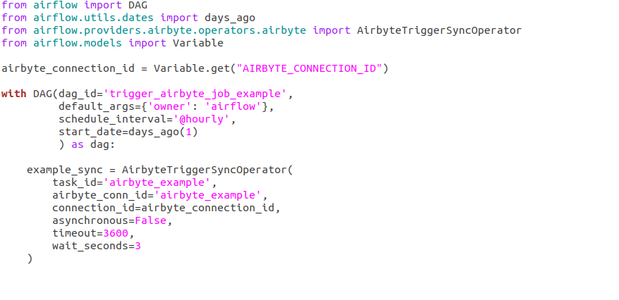
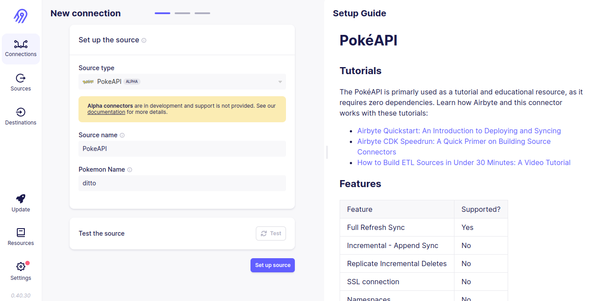
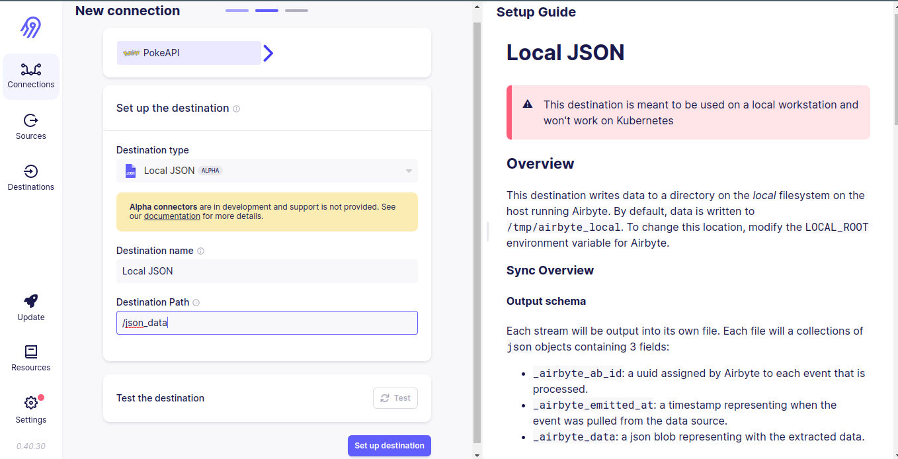
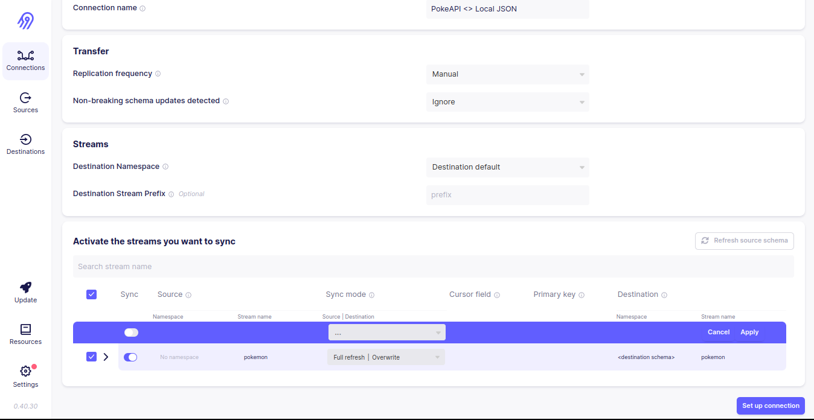
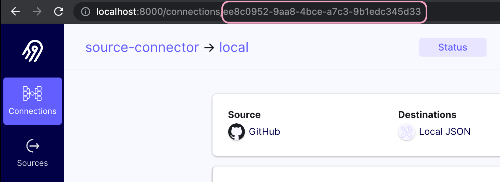
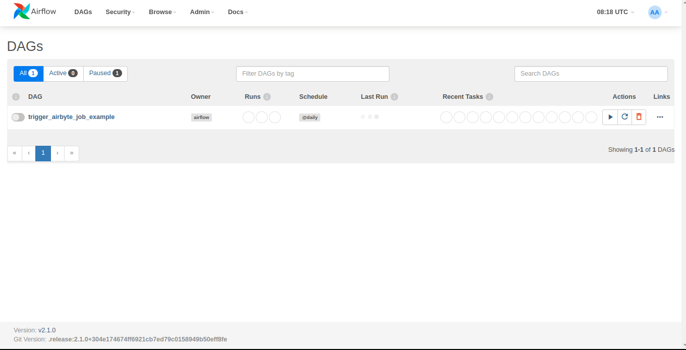
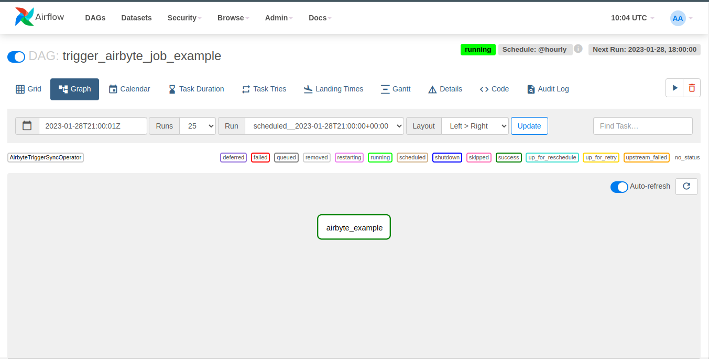
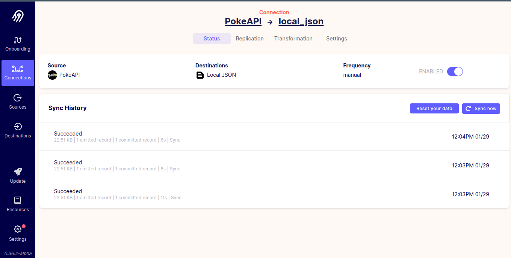
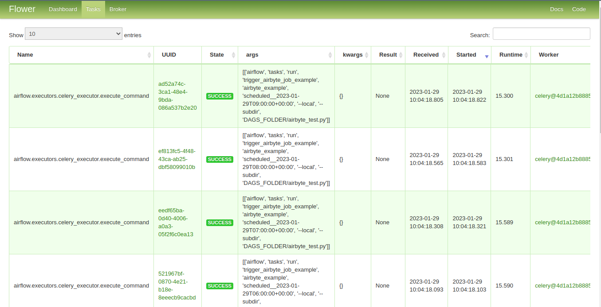

# airbyte-airflow-simple-scraper <!-- omit in toc -->

## Overview

This is a guide to setup an Airbyte Api connection that is orchestrated by Airflow.

- Airflow orchestration Dag example

  

## Setup

### Step 1:

- Create an AWS EC2 instance as follows

  - **Name : airbyte**
  - **AWS Machine Image : Amazon Linux 2 Kernel 5.10 / 64 bit (x86)**
  - **Instance type : t2.large 8g Memory**
  - **Key pair (login) : Create a key pair to SSH login from your host**
  - **Network settings : Create security group & ALLOW SSH traffic from your host ip address**
  - **Configure storage : 15 GB gp2**

### Step 2:

- Edit security group inbound rules and expose the following ports

  - 8000 → for Airbyte webapp
  - 8080 → for airflow webapp
  - 5555 → for flower-monitoring

### Step 3:

- SSH Log in to your AWS instance & Run the following commands to install docker & clone the github repo

  ```bash
  sudo yum -y update && \
  sudo yum install -y git && \
  sudo yum install -y docker && \
  sudo usermod -a -G docker $USER && \
  git clone https://github.com/ahmedfarag9/airbyte-airflow-simple-scraper.git && \
  cd airbyte-airflow-simple-scraper && \
  newgrp docker
  ```

- Prepare the environment

  ```bash
  bash install.sh
  ```

- Build airflow image

  ```bash
  make build-airflow-image
  ```

- Start Airflow/Airbyte stack

  ```bash
  make start-airflow-airbyte-stack
  ```

- Now your setup is ready!

- The current terminal session will be used for logging stream

### Step 4:

- Access Airbyte at http://localhost:8000 and set up a connection

  Set up a Source

  

  Set up a Destination

  

  Set up a Connection

  

  Go to the connections page and choose your connection
  then copy connection id from page url

  

### Step 5:

- Open a new terminal session & SSH Log in to your AWS instance & Run the following commands to set the API connection id

  ```bash
  cd airbyte-airflow-simple-scraper/ && \
  bash auto_connection.sh
  ```

- Then Enter the copied Airbyte connection ID when prompted

### Step 6:

- Access Airflow at http://localhost:8080 & enter the credentials

  - USERNAME=airflow

  - PASSWORD=airflow

  

- Activate dag to triger Airbyte to fetch Api data

  

- Then you will notice task is executed successfully in airflow task diagram

  

- And data sync is triggered successfully in Airbyte UI

  

- Finally you can Access Airflow flower for data monitoring at http://localhost:5555

  

---

## Commands

- Stop then start Airflow/Airbyte stack again

  - Hit control C to stop the stack then execute the following command to start it once again

    ```bash
    make start-airflow-airbyte-stack
    ```

- Uninstall Airflow/Airbyte stack

  ```bash
  make uninstall-airflow-airbyte-stack
  ```

- Remove containers and restart stack

  ```bash
  make restart-airflow-airbyte-stack
  ```

- Purge then clean install everything

  ```bash
  make purge-then-clean-install
  ```

- Refer to the Makefile for more info

---

## Architecture

- Airbyte --> data integration engine

  - UI: An easy-to-use graphical interface for interacting with the Airbyte API. (runs on port 8000)

  - Server: Handles connection between UI and API. (runs on port 800)

  - Scheduler: The scheduler takes work requests from the API and sends them to the Temporal service to parallelize.

  - Worker: The worker connects to a source connector, pulls the data and writes it to a destination.

- Airflow --> workflow management platform

  - Airflow consists of several components:

  - Postgres Database for Metadata --> Contains information about the status of tasks, DAGs, Variables, connections, etc.

  - Scheduler --> Reads from the Metadata database and is responsible for adding the necessary tasks to the queue

  - Executor --> Works closely with the Scheduler to determine what resources are needed to complete the tasks as they are queued

  - Web server --> HTTP Server provides access to DAG/task status information

- Postgres --> Metadata Database

- Celery Executor --> The Remote Executor to scale out the number of workers.

- Redis --> Used as a message broker by delivering messages to the celery workers.

- Flower --> Celery Monitoring Tool (runs on port 5555)

<!---

## Resources

This repo is based on the following resources so feel free to check them for documentaion and more details

https://github.com/nialloriordan/airbyte-airflow-scraper

https://github.com/airbytehq/airbyte/tree/master/resources/examples/airflow

https://docs.airbyte.com/operator-guides/using-the-airflow-airbyte-operator/

https://airbyte.com/tutorials/data-scraping-with-airflow-and-beautiful-soup

-->
